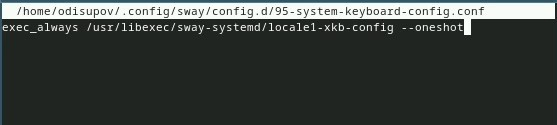
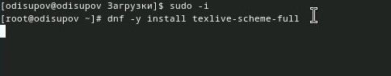

---
## Front matter
title: "Лабораторная работа № 1"
subtitle: "Отчёт"
author: "Исупов Олег Денисович"

## Generic otions
lang: ru-RU
toc-title: "Содержание"

## Bibliography
bibliography: bib/cite.bib
csl: pandoc/csl/gost-r-7-0-5-2008-numeric.csl

## Pdf output format
toc: true # Table of contents
toc-depth: 2
lof: true # List of figures
lot: true # List of tables
fontsize: 12pt
linestretch: 1.5
papersize: a4
documentclass: scrreprt
## I18n polyglossia
polyglossia-lang:
  name: russian
  options:
	- spelling=modern
	- babelshorthands=true
polyglossia-otherlangs:
  name: english
## I18n babel
babel-lang: russian
babel-otherlangs: english
## Fonts
mainfont: PT Serif
romanfont: PT Serif
sansfont: PT Sans
monofont: PT Mono
mainfontoptions: Ligatures=TeX
romanfontoptions: Ligatures=TeX
sansfontoptions: Ligatures=TeX,Scale=MatchLowercase
monofontoptions: Scale=MatchLowercase,Scale=0.9
## Biblatex
biblatex: true
biblio-style: "gost-numeric"
biblatexoptions:
  - parentracker=true
  - backend=biber
  - hyperref=auto
  - language=auto
  - autolang=other*
  - citestyle=gost-numeric
## Pandoc-crossref LaTeX customization
figureTitle: "Рис."
tableTitle: "Таблица"
listingTitle: "Листинг"
lofTitle: "Список иллюстраций"
lotTitle: "Список таблиц"
lolTitle: "Листинги"
## Misc options
indent: true
header-includes:
  - \usepackage{indentfirst}
  - \usepackage{float} # keep figures where there are in the text
  - \floatplacement{figure}{H} # keep figures where there are in the text
---

# Цель работы

Целью данной работы является приобретение практических навыков установки операционной системы на виртуальную машину, настройки минимально необходимых для дальнейшей работы сервисов.

# Задание

Здесь приводится описание задания в соответствии с рекомендациями
методического пособия и выданным вариантом.

# Выполнение лабораторной работы

1. Для начала создадим виртуальную машину(ВМ),укажем имя и адрес к загрузочному носителю.

{#fig:001 width=70%}

2. Далее выделяем память и количество ядер процессора.

{#fig:002 width=70%}

3. Выделяем виртуальный диск в размере 80 Гб.

{#fig:003 width=70%}

4. Включаем 3D-ускорение.

{#fig:004 width=70%}

5. Запускаем ВМ и установщик liveinst.

{#fig:005 width=70%}

6. Выбераем язык.

{#fig:006 width=70%}

7. Указываем диск.

{#fig:007 width=70%}

8. Включаем root пользователя и устанавливаем пароль.

{#fig:008 width=70%}

9. Создаём свою учётную запись.

{#fig:009 width=70%}

10. После установки достаём загрузочный диск.

{#fig:010 width=70%}

11. Переключитесь на роль супер-пользователя.

{#fig:011 width=70%}

12. Обновить все пакеты.

{#fig:012 width=70%}

13. Программы для удобства работы в консоли.

{#fig:013 width=70%}

14. Установка программного обеспечения.

{#fig:014 width=70%}

15. Запустите таймер.

{#fig:015 width=70%}

16. В файле /etc/selinux/config замените значение.

{#fig:016 width=70%}

17. Запустите терминальный мультиплексор tmux.

{#fig:017 width=70%}

18. Переключитесь на роль супер-пользователя.

{#fig:018 width=70%}

19. Установите средства разработки.

{#fig:019 width=70%}

20. Установите пакет DKMS.

{#fig:020 width=70%}

21. В меню виртуальной машины подключите образ диска дополнений гостевой ОС.

{#fig:021 width=70%}

22. Подмонтируйте диск

{#fig:022 width=70%}

23. Установите драйвера.

{#fig:023 width=70%}

24. Создайте конфигурационный файл.

{#fig:024 width=70%}

25. Отредактируйте конфигурационный файл. 

{#fig:025 width=70%}
 
26. Отредактируйте конфигурационный файл. 

{#fig:026 width=70%}

27. Установите имя хоста.

{#fig:027 width=70%}

28. Проверьте, что имя хоста установлено верно.

{#fig:028 width=70%}

29. Внутри виртуальной машины добавьте своего пользователя в группу vboxsf.

{#fig:029 width=70%}

30. В хостовой системе подключите разделяемую папку

{#fig:030 width=70%}

31. Установка с помощью менеджера пакетов

{#fig:031 width=70%}

32. Установим дистрибутив TeXlive

{#fig:032 width=70%}

# Домашнее задание

Получите следующую информацию.

Версия ядра Linux (Linux version).
Частота процессора (Detected Mhz processor).
Модель процессора (CPU0).
Объём доступной оперативной памяти (Memory available).
Тип обнаруженного гипервизора (Hypervisor detected).
Тип файловой системы корневого раздела.
Последовательность монтирования файловых систем.

{#fig:033 width=70%}

{#fig:034 width=70%}

# Выводы

Я приобрёл практические навыки установки операционной системы на виртуальную машину, настройки минимально необходимых для дальнейшей работы сервисов.

# Список литературы{.unnumbered}

::: {#refs}
:::
